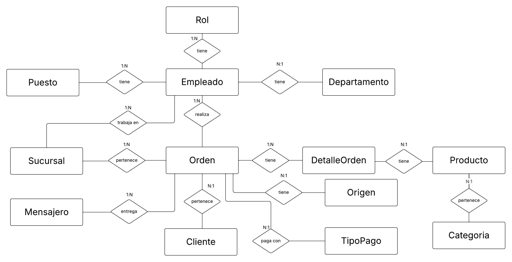

# 🍔 Fast Food: Diseño y Análisis de Base de Datos SQL

## 📖 Descripción del Proyecto

En este proyecto simulamos el rol de un **Data Analyst** contratado por la cadena "Fast Food". El desafío consistió en construir una base de datos desde cero utilizando archivos crudos, diseñando una arquitectura escalable que permita a la empresa evolucionar su gestión de información.

Utilizando **SQL Server**, se abarcó el ciclo completo del dato: desde el diseño del esquema (DDL) y la normalización, hasta la ingesta de datos y la extracción de insights complejos (DML) para la toma de decisiones estratégicas.

---

## 🎯 Objetivos y Desafíos

1.  **Ingeniería de Datos (DDL):** Diseñar y crear tablas optimizadas, definir claves primarias/foráneas y asegurar la integridad referencial para garantizar la escalabilidad futura.
2.  **Manipulación de Datos (DML):** Importar datos existentes y realizar consultas complejas para responder preguntas de negocio.
3.  **Business Intelligence:** Analizar la eficiencia operativa, productividad de empleados y comportamiento de ventas.

---

## 🏗️ Modelado de Datos

Una parte crucial del proyecto fue traducir los requisitos de negocio en un modelo de base de datos eficiente.

### Diagrama Entidad-Relación (DER)
Se identificaron las entidades clave y sus relaciones lógicas.

### Modelo Relacional Implementado
Estructura final de la base de datos lista para producción en SQL Server.

---

## 🔎 Análisis y Consultas SQL

El proyecto no se limitó a guardar datos, sino a interrogarlos. Se desarrollaron scripts SQL para responder a tres niveles de complejidad:

### 1. Nivel Operativo (Consultas Simples)
* *¿Cuántos empleados trabajan por departamento?*
* *¿Cantidad de productos existentes por categoría?*

### 2. Nivel Táctico (Agregaciones y Promedios)
* *¿Cuál es el precio promedio de los productos dentro de cada categoría?*
* *¿Cuántos productos de cada tipo se han vendido en cada sucursal?*

### 3. Nivel Estratégico (Joins Complejos y Patrones)
Se analizaron métricas de rendimiento utilizando `JOINs`, `GROUP BY` y funciones de ventana:
* **Eficiencia Logística:** Análisis de tiempos de entrega de los mensajeros.
* **Productividad:** Ventas generadas por empleado.
* **Tendencias:** Identificación de horarios pico.

---

## 💡 Insights Clave del Negocio

Gracias al análisis de datos, se presentaron las siguientes conclusiones a la gerencia:

* **🕗 El "Prime Time" de las Mañanas:** Contrario a lo esperado, Fast Food realiza el mayor volumen de ventas durante la franja matutina.
* **💰 Rentabilidad:** La venta con mayor beneficio (margen) también se registró en el horario de la mañana, indicando una oportunidad para optimizar promociones de desayuno/almuerzo temprano.

---

## 🛠️ Stack Tecnológico

* **Motor de Base de Datos:** SQL Server 2019.
* **Lenguaje:** T-SQL (Transact-SQL).
* **Herramientas:** SQL Server Management Studio (SSMS).

---

## 📁 Estructura del Repositorio

* `/Scripts`: Contiene los archivos `.sql` con el código de creación (DDL) y consultas (DML).
* `Informe`: Informe ejecutivo con el análisis detallado.

---
**Autor:** Francisco Javier Hillebrand
[LinkedIn](Tu_Link_Aquí) | [Portafolio](Tu_Link_Aquí)
